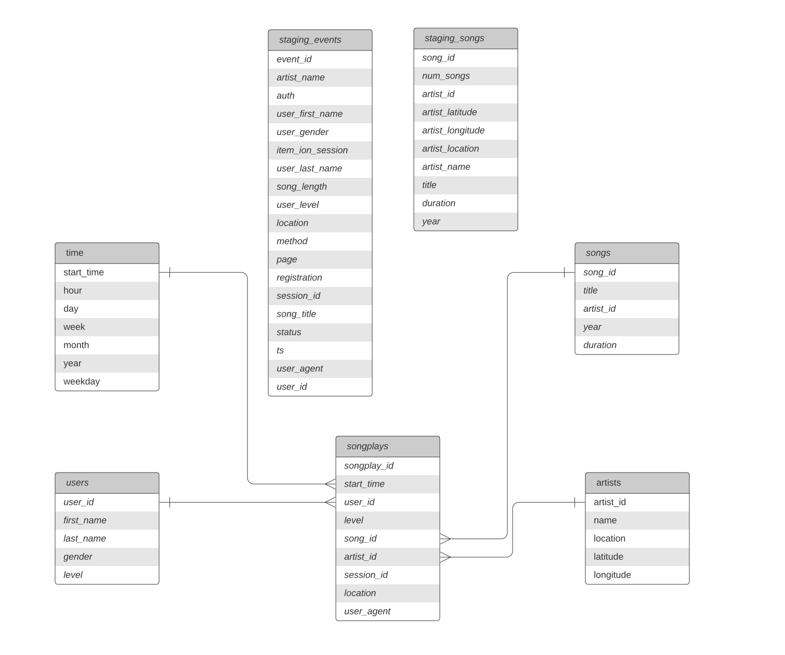

# Datawarehouse-on-AWS

ETL pipeline that extracts data from S3, stages them in Redshift, and transforms data into a set of dimensional tables for analytics.

## Project Scope

- A music streaming startup, Sparkify, has grown their user base and song database and want to move their processes and data onto the cloud. Their data resides in S3, in a directory of JSON logs on user activity on the app, as well as a directory with JSON metadata on the songs in their app.
- Build ETL pipeline that extracts their data from S3, stages them in Redshift, and transforms data into a set of dimensional tables for their analytics team to continue finding insights into what songs their users are listening to. You'll be able to test your database and ETL pipeline by running queries given to you by the analytics team from Sparkify and compare your results with their expected results.

## How to use

- Create tables
```$ python create_tables.py```
- Load Data
```$ python etl.py```

## Project Files

- `create_table.py` is where you'll create your fact and dimension tables for the star schema in Redshift.
- `etl.py` is where you'll load data from S3 into staging tables on Redshift and then process that data into your analytics tables on Redshift.
- `sql_queries.py` is where you'll define you SQL statements, which will be imported into the two other files above.
- `README.md` is where you'll provide discussion on your process and decisions for this ETL pipeline.

## Dataset

Two datasets that reside in S3. Here are the S3 links for each:

- Song data: `s3://udacity-dend/song_data`
- Log data: `s3://udacity-dend/log_data`

Log data json path: `s3://udacity-dend/log_json_path.json`

### 1.Song Dataset

The first dataset is a subset of real data from the [Million Song Dataset](http://millionsongdataset.com/). Each file is in JSON format and contains metadata about a song and the artist of that song. The files are partitioned by the first three letters of each song's track ID. For example, here are file paths to two files in this dataset.

```
song_data/A/B/C/TRABCEI128F424C983.json
song_data/A/A/B/TRAABJL12903CDCF1A.json
```

And below is an example of what a single song file, TRAABJL12903CDCF1A.json, looks like.

```json
{"num_songs": 1, "artist_id": "ARJIE2Y1187B994AB7", "artist_latitude": null, "artist_longitude": null, "artist_location": "", "artist_name": "Line Renaud", "song_id": "SOUPIRU12A6D4FA1E1", "title": "Der Kleine Dompfaff", "duration": 152.92036, "year": 0}
```

### 2.Log Dataset

The second dataset consists of log files in JSON format generated by this [event simulator](https://github.com/Interana/eventsim) based on the songs in the dataset above. These simulate activity logs from a music streaming app based on specified configurations.

The log files in the dataset you'll be working with are partitioned by year and month. For example, here are filepaths to two files in this dataset.

> log_data/2018/11/2018-11-12-events.json
> log_data/2018/11/2018-11-13-events.json

And below is an example of what the data in a log file, 2018-11-12-events.json, looks like.


## Schema

Using the song and log datasets, I need to create a star schema optimized for queries on song play analysis. This includes the following tables.

### Fact Table

1. songplays - records in log data associated with song plays i.e. records with page `NextSong`
   - songplay_id, start_time, user_id, level, song_id, artist_id, session_id, location, user_agent

### Dimension Table

1. users - users in the app
   - user_id, first_name, last_name, gender, level
2. songs - songs in music database
   - song_id, title, artist_id, year, duration
3. artists - artists in music database
   - artist_id, name, location, latitude, longitude
4. time - timestamps of records in songplays broken down into specific units
   - start_time, hour, day, week, month, year, weekday


## Project Steps

### Create Table Schemas

1. Design schemas for fact and dimension tables
2. Write a SQL `CREATE` statement for each of these tables in `sql_queries.py`
3. Complete the logic in `create_tables.py` to connect to the database and create these tables
4. Write SQL `DROP` statements to drop tables in the beginning of `create_tables.py` if the tables already exist. This way, run `create_tables.py` whenever want to reset database and test ETL pipeline.
5. Launch a redshift cluster and create an IAM role that has read access to S3.
6. Add redshift database and IAM role info to `dwh.cfg`.
7. Test by running `create_tables.py` and checking the table schemas in redshift database.

### Build ETL Pipeline

1. Implement the logic in `etl.py` to load data from S3 to staging tables on Redshift.
2. Implement the logic in `etl.py` to load data from staging tables to analytics tables on Redshift.
3. Test by running `etl.py` after running `create_tables.py` and running the analytic queries on your Redshift database to compare your results with the expected results.
4. Delete redshift cluster when finished.
